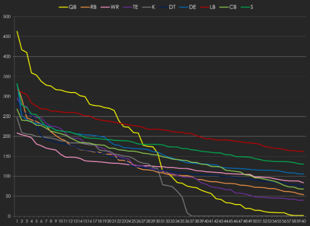

```{r setup, include=FALSE}
knitr::opts_chunk$set(echo = FALSE)

# Learn more about creating blogs with Distill at:
# https://rstudio.github.io/distill/blog.html

```

# Introduction
Fantasy Football is a fun game to play on the back of real football.  But whereas fantasy mostly just covers offensive players who touch the ball IDP [Individual Defensive Player] is a version of fantasy football that tries to reflect the sport as a whole rather than just one aspect of it.

‘Standard’ fantasy can often just seem to revolve around wide receivers and running backs with quarterback commoditized and very few relevant tight ends.  In contrast IDP can give you up to different positions to manage which makes roster, drafting and trading decisions much more interesting and impactful.  Strategically it’s a far deeper and more varied game.

All of this begs the question why IDP isn’t bigger than it is.  Maybe 10% of dynasty leagues are IDP ones and only around 5-10% of season-long leagues.  And many of those are IDP-lite with very little depth.  Reasons as to why this is vary.  If you ask someone who plays fantasy but not IDP why the most common response is that IDP is just too much to learn and too big a commitment.  This seems unlikely to be the real answer given how many non-IDP players spend a huge amount of time on their hobby.  Dividing that time among offensive and defensive players would be very feasible.  In fact if you ask people that do play IDP they’ll mostly tell you it’s not that hard.  And we’re talking about pretty committed football fans in the first place.  Shouldn’t they already know this stuff?

The likeliest answer to me is that actually a higher proportion of football fans than is suspected only actually watch the ball.  They only know defensive players when their name is called and they have very little idea how defense works.  It’s a moot point anyway.  Many people are dead-set against IDP and that’s their prerogative. If they want to limit themselves they can.

But anyone reading this is probably interested in a deeper experience with more decisions and more opportunities to educate themselves about football.  Hopefully this document will enable you to get quickly up to speed with what IDP is and how it works and to start being more successful in IDP leagues you play in.

# History of IDP
IDP has actually been going quite a long time.  I first experienced it around 1998 with a league on Sandbox that had multiple IDP starters.  DeWayne Washington the Steelers defensive back was my superstar player on the back of his 79 solo tackles that year.

That league was very much the exception though, and IDP has changed drastically over the last 20 years.  A common narrative back then was IDP was interesting, but leagues should just dip their toes in to see if it was for them.  They did this by just including a very small number of IDP slots.  Typically 3 [one each of defensive line, linebacker and defensive back] but I played in leagues with just one IDP slot.  I even commissioned one.

This drives many fantasy owners away because leagues like that feel entirely random.  And in many ways they are.  With only a very small number of required starters [compared to a huge number of available options] everyone always has a stud and it’s just a matter of whose stud is better in any given week.  That doesn't feel fun to play in at all [source: my experience of playing in crap leagues] and often puts people off IDP for good.  A common criticism is that IDP is entirely random and cannot be predicted intelligently or reliably.  This often arises from people who played in a too-small league.  Imagine playing in an eight-team league with just one wide receiver able to be used by each team.  It would feel very random wouldn’t it? Every team would have a Julio or Nuk or OBJ.  Over the season they’d all do very well but on a weekly basis the variance would look enormous. It’s the same issue with IDPs. Just using a few of them isn’t fun.

Back in the day IDP was really built around just a few stats.  The tackle was all-important and seen as the currency of defensive football with sacks and interceptions secondary.  Many leagues only used those three categories and standard scoring was one point per tackle with sacks/picks worth 3 or 4.  Because sacks are less important than TDs and TDs score 6 points.  

This led to a situation where players who piled up tackles were worth far more than any others.  Recording lots of tackles and big plays together is ideal but that doesn’t often happen.  Most players are either one or the other.  In the NFL the lion’s share of defensive stats are recorded by linebackers so linebackers generally scored far more points than any other position.  For years the best IDP analysis was basically “draft LBs early and often”.  

This was the equivalent of old fantasy leagues back in the 80s where they only scored points for touchdowns.  Technically it reflected the NFL but it did a really bad job of representing which players were actually playing well.

In recent years the flood of data has meant more and better statistics are being used to score IDPs.  Tackles for a loss [TFLs], assists, passes defended and even QB hits are all frequently used now.  And there’s many more datapoints on the horizon which should enable even better scoring.  

Lineups and positional scoring have developed rapidly over the last few years.  There are now many types of league that focus on different aspects and IDP has gone from extremely basic [because no-one knew any better] to bewilderingly complex [because there’s no central, accepted idea of what standard is].

Looking for a definition of what ‘standard’ is is probably futile.  There’s just too many differing views and people like what they like. This document isn’t about teaching you what is best.  It’s about teaching you to figure out what you're looking for and how you can take advantage of any given league.

# Modern Defensive Football

Anyone with a passing interest in football is aware of the offensive shifts that have taken place over the last 20 years.

In the early 00s spread offense was sweeping the college landscape [headlined by Urban Meyer] as coaches found ways to make offenses more efficient and explosive by building around the passing game more than ever before.  This spread into the NFL until the pros were full of spread-out offenses with quarterbacks who play in the shotgun.  This is where we find ourselves now with 68% of all offensive yards in 2018 being passing yards.

Defense as ever has to move just as fast [if it didn’t it would be Arena league] but because so many fans don’t watch defense public conception of defensive schemes lags behind.

Most NFL teams use a defensive formation they refer to as ‘base’.  This doesn’t mean they use it the most.  Or they’re most comfortable with it. It’s just a legacy term.  In the old days when defenses only had 2 or 3 plays base really would be that but these days it’s normally a relatively small part of a defense.

There are two basic base defenses in the NFL: the 43 [even front] and the 34 [odd front].  Before we get to them though we’ll cover basic positions and their sub-classifications.

### Defensive Tackle

Tackles are huge men who are asked to take on offensive linemen block after block and use strength to beat their opponents.  A big part of their game is tackling rushers but they’re increasingly important as pass rushers too.  There are 2 main types of tackle:

  - Nose tackle
  
  300lb+ behemoths who line up over the centre or maybe a guard.  They often handle double teams and as such need to be tough to move rather than nimble.  
  Archetype: Vince Wilfork / Damon “Big Snacks” Harrison

  - Undertackle
  
  These men are still bigger than most people you see in real life but are noticeably smaller and faster than noses.  They tend to line up offset to shoot gaps.
  Archetype: Warren Sapp / Geno Atkins.

### Defensive End

Ends are the glamourous pass rushers of linemen.  They’re long, tall athletes who can win with strength, leverage, technique or sheer speed.  

- 4-3 DE

  In a 43 they’re the primary pass rushers asked to beat tackles and get the QB on the floor.  They’ll generally line up across from tackles but can be deployed from way outside the tight end.   They need to set the edge too and have responsibility against the run but they live and die on pass rush.
  Archetype: Michael Strahan / Danielle Hunter.

- 3-4 DE

  In a 34 defense the ends play closer to the centre and as a result are up against bigger guys in tighter confines.  These guys are less about speed and outside moves and closer to tackles than other ends.  Players can often move between 34 DE and undertackle in 43 defenses.
  Archetype: Justin Smith / Chris Jones.


### Linebacker

Linebackers are the most flexible defenders in football.  They’re asked to defend the run, play in coverage and rush the passer.  Because they’re physically closest to the centre of a defense they tend to perform the highest proportion of tasks recorded on the ball.

  - Middle LB
  
  This is the classic “Mike” LB.  These guys rack up huge numbers of tackles because they’re right at the heart of a defense.  They’re often asked to wear the green dot helmet and act as defensive playcallers as well as playmakers.
  In effect all 43 inside middle LBs and 34 inside LBs belong in this pot.
  Archetype: Ray Lewis / Luke Kuechly.
  
  - 43 outside LB
  
  In an old-fashioned 43 defense these would be the outside LBs [the Will and Sam].  It’s a position that is used less and less with the leaguewide move away from base defenses.
  Archetype: Lance Briggs.
  
  - 34 outside LB
  
  In a 34 defense these are the primary pass rushers.  In fact although they’re referred to as linebackers they often line up and play as linemen.  They are rarely asked to cover but they do it more than 43 DEs.  They’re generally smaller and lighter than ends with the belief they need to play in space more.
  Archetype: Lawrence Taylor / Von Miller.
  
  - Mike
  
  The off-ball linebacker asked to play in the middle of the defense.  He’s often the playcaller and needs a skillset which enables him to make big plays against the run {sorting through traffic as well as beating blocks and being a big hitter] as well as playing in coverage where he’ll often be asked to play a lot of zone concepts and break to the ball.
  Archetype: Ray Lewis / Luke Kuechly.
  
  - Sam
  
  Sam [named because he lines up on the strong side] is a position used less and less in the NFL.  He’s often the biggest LB because going up against TEs is a big part of his job.  He’s often asked to rush the passer quite a lot and because of their size and strength are often weaker coverage players.
  Archetype: Dont’a Hightower / Devon Kennard
  
  - Will
  
  These guys play on the opposite side from the Sam.  They're named because they play on the weak side.  They’re often smaller, faster players because they’re asked to do more in coverage.  They’re often zone players first but sometimes they’re expected to play man against RBs or TEs.
  Archetype: Thomas Davis / Deone Bucannon

### Cornerback

Corners are a defense’s primary pass-defenders. As a coach one told me it’s the toughest job in football.  They have to be as fast as receivers without being fooled by route running or jukes and they have to do it all backwards.

  - Outside corner
  
  These players line up on wide receivers on the perimeter of defenses.  Their primary job is to ensure those WRs do not catch the ball, or if they do make an early tackle.  
  Corners are often referred to by their primary coverage styles [ cover 2 corner, press man corner, zone corner etc] but this practise has thankfully fallen away a little.  In reality all NFL corners are asked to perform various techniques within games because disguise and surprise are so important.
  Archetype: Deion Sanders / Richard Sherman
  
  - Slot corner
  
  These corners are named poorly because they fundamentally do not line up on the corner.  By definition a slot receiver has to have a man outside of him.
  Traditionally slot receivers were smaller, more agile and speedier than outside receivers so slot corners are often the same.  They need to be able to move well in space, make quick decisions and have lightning reflexes.  As offenses use more types of players in the slot these defenders are increasingly becoming more diverse too,
  Archetype: Antoine Winfield / Desmond King


### Safety

Safeties traditionally were the deepest defenders.  The last line of defense. But as football has evolved and become more complex safeties are maybe the most interesting position in the sport.  They’re asked to do literally everything on the field regularly.  It’s often tough to watch them on standard gamefilm but immensely rewarding.  Safeties teach us so much about how modern football is played.

  - Strong safety
  
  These guys are almost extra linebackers.  They‘re often asked to play down in the box and be an additional run defender whilst they run many coverage concepts similar to LBs too.  They’re bigger and more physical defenders who are the classic big hitters of the defensive backfield.
  Archetype: Bob Sanders / Keanu Neal.
  
  - Free safety
  
  This position is closer to the original use of safeties,  They play deep and are asked to defend the deep ball whilst acting as a backup to players in front of them.  Centre-fielder single-high safeties fall into this category.  Range is a huge part of their game as they need to react to the QB and make it anywhere across the field before the ball does.
  Archetype: Ed Reed / Earl Thomas
  
  - 2-deep safety
  
  Many teams and defenses do not use a traditional strong/free safety split.  The classic Tampa 2 used simply left and right safeties and this is still common today. These players have to have varied skill-sets and be able to perform any of the responsibilities more specialist safeties might be.
  Archetype: John Lynch / Shawn Williams
  
  - Nickel safety
  
  Increasingly we’re seeing nominal safeties playing in the slot as those slot players start to diversify.  
  Jayron Kearse is 6’4” and 214 lbs.  Tyrann Mathieu is 5’9” and 185.  The slot is becoming ever more interesting.
  Archetype: Antoine Winfield / Budda Baker.


## Schemes in the NFL

### 4-3

This scheme traditionally features 2 DTs, 2 DEs, 3 LBs, 2 CBs and 2 Ss.

- The DTs are most commonly separated into a nose tackle and an under-tackle.
- The DEs are 7 techs.
- The LBs are one middle LB and 2 43 outside LBs.
- Both CBs are outside corners.
- The safeties can be pretty much any combination of strong, free or 2-deep.


### 3-4 

This scheme traditionally features 1 DT, 2 DEs, 4 LBs, 2 CBs and 2 Ss.

- The DT is a nose tackle.
- The DEs are 5 techs.
- The LBs are two inside LBs and 2 OLBs.
- Both CBs are outside corners.
- The safeties can be pretty much any combination of strong, free or 2-deep.


## Sub Packages
For much of the 20th century the above was what you’d see on an NFL field.  Both systems had their advocates and were equally able to stop offenses depending on personnel, playcalling, etc.  When teams had to face pass-heavy formations and personnel they would simply shift into one of their sub-packages.  But base formations were king.

In the 21st century things have changed.  The league has rapidly shifted to using sub packages more and more in line with offenses using more spread concepts and lighter personnel.  The days of 2 TEs creating 7-man offensive lines with a FB and a RB in the backfield and a single,skinny wideout shivering on the touchline are gone.  As a result defenses need to be faster and more versatile, which means primarily more defensive backs on the field.

Nickel is often referred to as “the new base” and generally is used for over half a team’s defensive snaps.  The most common two personnel groupings are:

### 4-3 Nickel

This scheme traditionally features 2 DTs, 2 DEs, 2 LBs, 3 CBs and 2 Ss.

- The DTs are most commonly separated into a nose tackle and an under-tackle.
- The DEs are 7 techs.
- The LBs are both inside LBs.
- Two CBs are outside corners and the third is a slot corner.
- The safeties can be pretty much any combination of strong, free or 2-deep.


### 3-4 Nickel

This scheme traditionally features 2 defensive linemen, 4 LBs, 3 CBs and 2 Ss.

- The linemen are often DEs rushing from the inside but can be tackles too.
- The LBs are two inside LBs and 2 OLBs.
- Two CBs are outside corners, with the third being a slot corner.
- The safeties can be pretty much any combination of strong, free or 2-deep.


### Other schemes

There are far, far more personnel groupings than these [I haven’t even touched on dime, or 43 under/over variations etc] but this is a good starting point.  If you know this you can be a good IDP player.  Knowing more about different schemes is always better but it becomes far less efficient in terms of benefit/time.

# Golden Rules of IDP

- There is no such thing as balance.

  In IDP league terms that is.  There are fundamentally a lot more IDPs than players at some offensive positions.  There are just 32 QBs each week.  But around 80 CBs each week.

  On top of that scoring distribution varies a lot too.  Only a few RBs will reach the top levels.  But many LBs score very similarly.

  Leagues are not balanced. If you think your league is then you just haven’t spotted where the positional advantage is yet.

- Volume is king.

  The number one thing you want from an IDP is playing time.

  At the very least you want a player who plays as near to 100% of his team’s snaps as possible.    Situational pass rushers or DBs who only play in nickel packages are no good.  Players on teams who play low snap totals are no good.

  Passing plays are quicker in game clock terms so IDPs who face pass-heavy teams will play more snaps.

- In the box please.

  After volume you’re looking for players as close to the action as possible.  For safeties and corners that means in the box.  For LBs that means you want a low % of their time spent rushing the passer or stopping the run.

- Things change fast.

  With offensive players you might be able to pick a player you can keep for a decade.  That’s very unlikely to happen with IDPs.  Don’t try to play for the long-term because it won’t happen.  Just concentrate on building a competitive roster every year.  Veterans are often the key to this.

- Tackles are not good.

  Well yeah, they’re better than missed tackles.  But tackles are a poor way of judging player quality.  For every Bobby Wagner there’s a few Tahir Whiteheads.  Poor players who just happen to have roles that generate high tackle numbers.  These guys often get replaced with their owners asking “what happened?  I thought he was good?”

## What Should Starting Requirements Look Like?

I’ve written conflicting things in this article.  I’ve mentioned that people like playing different ways but also criticised IDP-lite league with too few starters.

The truth is that you can play however you like and no-one can tell you what to think.  However, I’ve spent a lot of time on this and I think I know a bit about it.  If you want my point of view then here it is:

> I want offense and defense to be of roughly equivalent scoring on any given team.  But that doesn’t mean I want all players to score the same.  Because there are fundamentally more IDPs than offensive players [until someone figures out a good way to play O line fantasy] it needs some adjusting.  I prefer a couple more IDPs than offensive players but the total scoring to be the same on either side of the ball.  11 offensive players to 13 IDPs is about right.

There are 2 common objections to this:

- It’s not realistic.

  You’re playing a game on the interweb. And many fantasy lineups can start 3 or 4 running backs per team.  Or 2 quarterbacks.  And no offensive line.  Nothing about fantasy football is realistic.

- It’s not symmetrical.

  Who cares?  The same people who want symmetry tend to think their league is balanced.  I’m interested in fun game mechanics not pleasingly equal lineups.

For my 13 defensive starters [Im assuming a 12-team league here] I want:

- 2 x DTs

  With just one DT everyone has easy access to good starters all the time.  2 starters each means that deeper knowledge is a benefit to owners.  And also that managing to get hold of 2 of the limited number of reliable interior rushers is a real advantage.

- 2 x EDGEs

  2 pass rushers is about right.  Having fewer means everyone should have a stud and isn’t much fun.  2 rewards good depth on rosters and raises the chance of big plays per team each week.

- 3 x LBs

  In a 12-team league this means 36 starters per week.  With 2-3 full-time LBs per NFL team this means 64-96 available starters per week.  So about half to a third of the pool will be IDP starters.  Very similar to QBs or Ks in a 12-team league eh?  That’s no coincidence.
  3 starters per team rewards good depth knowledge and does a good job of ironing out splash weeks.


- 3 X CBs

  This is unusual but bear with me.  There are a LOT of corners in the NFL.  About 80 per week.  And the production curve is very shallow.  Meaning that the drop-off from a top 10 corner to a top 20 to a top 30 option is slight. In the vast majority of IDP leagues it’s possible to simply stream corners with a huge pool always available on waivers.  That’s not fun.  It’s just a pain.
  Coupled with my favoured scoring for the position starting 3 per week adds just enough stress onto the pool of available talent that it really is worthwhile holding onto good options.

- 2 X Ss

  Safety is such a variable position.  Any more than 2 starters really means that non-ideal IDP options like single-deep free safeties become starters.  That’s not much fun.

- 1 X flex

  Because everyone likes the ability to build a roster their way.  You want to go after all the dominant 3-techs in the league?  Go for it.  You want a roster built around risk/reward pass rushers? Be my guest. You want to cram in high-floor tackle hog LBs?  You and about 90% of other teams - but give it a go.

## Roster Size

This is always a matter of personal preference but please experiment with bigger rosters.  This also raises an interesting point.  Almost every IDP player thinks their league is “super deep” regardless of it’s real comparative size.  A good rule of thumb is:

- 3 or fewer IDPs per team / rosters 30 or smaller
  
  IDP-lite.  This is worse than not having IDP at all.

- 6 or fewer IDPs starting per week / roster of 40 or lower

  This is a shallow IDP league.  You can do better.

- 11 or fewer IDPs per team / roster of 50 or fewer

  Medium sized league.  These are really fun but can still become huge pools of skill players with IDPs being streamed.

- 12 or more IDPs per week / roster 55+

  This is a large league. Congrats on hitting the big time.

- Roster 65+

  Things start to get really fun up here.  Best ball is probably the right setting for leagues this big.


## Best Ball

There have been some interesting experiments on bestball IDP in the last year or so.  And it really changes the game in a great way.  Instead of continually being frustrated that you left a certain player on the bench in the wrong week it rewards roster construction.  Amassing a stable of pass rushers or ballhawks really pays off over opponents who try to keep just the minimum of IDPs on their roster.

In the NFL a defense is only as strong as its weakest link and best ball is a great way to reflect that.


## Waivers

In smaller leagues waivers can be really fun.  In IDP it’s a bit of a death knell.  IDP is for true fans of football who like to better their understanding and knowledge.  For people like that [by which I mean us] building deep rosters of talented players yet to break out is more fun than racing to the waivers to find a random starting cornerback for this next week.

Make your rosters big.  I play in a league with rosters of 100.  And there’s still weekly waiver traffic every week.  Try it.  You can always stop if you don’t like it.


## Scoring Settings

Again - feel free to experiment and find settings you like. But here’s my thoughts on how to properly reward good IDPs.  please bear in mind IDP scoring always needs tweaking in conjunction with offensive scoring.  Neither should be seen as independent.  You're trying to build a fun league to play in - not come up with an algorithm that perfectly reflects reality.

- Defensive interior

  Lump tackes in with 34 DEs.  They all play roughly in the same place anyway and the score similarly.  This will really make your league more interesting.  Because where DT-specific leagues have maybe 5 really elite players you’ll suddenly have 2 or 3 times as many.  A top 5 tech might manage to get to 12 sacks in a good year [Chris Jones had 14 in 2018] which is more comparable to interior players than the true edge guys.  So lump them together.
  
  For these guys I also like to ramp tackles up too.  It reflects their ability to get off blocks and make plays in the trenches.  Doubling tackle scoring from LBs is about right.  Let’s say 2 for a solo and 1 for an assist.
  
  Rewarding passes defended is of course a must.  It’s generally batted down passes for these guys but that’s a high impact play.  4 points is about right.  Interceptions should remain at 6 points.  Because watching the big guys run with the ball is awesome.

- EDGE

  Edge not DE.  Lump in 34 OLBs with 43 DEs and you’ll remove a massive IDP hurdle - that of players having their position eligibility changed.  The two positions are pretty analogous in scoring and this is just a better solution.
  
  Now we’ve agreed that, scoring is pretty easy.  Most leagues have it set quite well.  Tackles should remain the same as inside LBs but sacks need ramping up.  Make it 5 or 6.  Sacks are immensely impactful plays.  The best sack-artists each year might get to about 15 of them.  About the same as TDs for top offensive players.  Scoring a couple of points for TFLs and QB its is good too.  You want to reflect pressure created not just sacks.

- LB

  In my leagues I like to keep tackles relatively low.  1.5 for a solo and 0.75 for an assist.  Tackles do not necessarily reflect quality.  In many cases offenses will deliberately target bad players who will therefore be in prime position to make the tackle.  You don't want to reward that more than necessary.
  
  LBs will rack up most stats anyway.  You don’t need to make them high scoring.  If you do that you just make your league very LB-centric.

- CB

  Tackles should be set lower than the LB base.  1 for a solo and 0.5 for an assist.  There is an extremely poor correlation for CB quality play and tackles.  In IDP leagues finding bad corners who have a starting job gets old quick.
  On the other hand defended passes correlates extremely well with quality play.  5 or 6 points per PD is about right.  That will seem extremely high to you but it works.  It means CB scoring is not left way behind other positions and also a bit less streaky. Give it a go.  It’s my favourite single setting in IDP scoring.

- S

  Keeping tackle scoring the same as LBs but slightly upweighting PDs and big plays works well.  A safety who can record sacks like Derwin James or Harrison Smith is a difference-maker.  A safety who plays in the box because he’s not athletic [hello Jon Cyprien] is just a guy.

# Finding Good IDPs

- D linemen

  Sacks here are the key but sacks are a non-sticky stat.  They fluctuate a lot from season to season.
  A better way to identify good seasons coming is to look for players who have had a lot of total pressures but not the equivalent sacks [Danielle Hunter in 2017].  Those guys often blow up.
  On the flip side avoid payers with a lot of sacks but relatively low sack numbers [hello Kyler Fackrell].  They often crash and burn.  Pressure is predictive.  Sacks are not.

- LB

  Depth charts are key in the off-season.  You’re looking for every-down players here so look for teams who have moved on from the guys who filled those roles last season.  In IDP you’re always looking for the next LB to step up.  
  In-season don’t wait for a big tackle week and then try and get the player.  Figure out who it is the week before.  You can see this easily with snaps.  When a player gets hurt you can just see who stepped in to play for him.  He’ll often be the starter the next week.
  Stat crews are also helpful here.  Crews award tackles at different rates with some [Seattle and Buffalo are often guilty] of handing out assists to inside LBs just for standing near the pile.

- CB

  100% snap guys are the benchmark.  On top of that you’re looking for corners who make plays on the ball.  You can spot them because they have a history of doing the same thing. 
  Historically there has been a belief that rookie corners score especially well but this is not true. There are always plenty of rookie corners ranked at the top of the position each year but this is just because CB is a position dominated by young players.

- S

  Volume and position are the top indicators.  100% snap players who play as much in the box as possible.  Don’t fall into the trap of thinking a deep safety might record enough PDs and interceptions to make up for their lack of tackles.  They rarely will.


# Offense vs IDP value

Remember the golden rules above? There is no such thing as balance.  Different positions have different values because the value distribution is different.

The number one question from people new to IDP is about relative value.  How much is a top IDP worth relative to offensive players?  The obvious answer is just to look at how many points those players and positions score but that’s a poor way to do it.  The answer is dependent on replaceability not absolute scoring.

Here’s a typical scoring chart for a league I saw recently:


Look at how steep the QB line is compared to the CB line.  In this league it’s a real advantage to have the top QB, but there’s little difference between the #5 CB and the #25 CB.  And all of the other positions are different too.

Instead of scoring you need to be accounting for value above replacement. How many points will you lose going from the player you own to the next best option you can get?  And how many points will you gain by going from what you’ve got to the player/asset you’d be bringing in?

The equation for this is more to do with starting lineups and roster size than it is for scoring.  The general shape of points distribution stays relatively stable year-on-year.  The top guy at each position generally scores about the same - it’s just a different player between years.  Darius Leonard and Pat Mahomes both had amazing 2018s. They’ll likely drop back a bit next season [because everything doesn’t go right for a player 2 years in a row] but other QBs and LBs will step up into those top spots as they stay healthy and everything goes right around them.  And in general defensive positions will stay flatter.

There’s two ways you can take advantage of this based on two types of league:

## Equal top leagues
Many leagues think they have balance because the top option at each position scores about the same. Here’s an example:



QB is high here but the others are closely bunched at the left of the chart.  In these leagues the flatter positions retain value down the ranks.  LB is very valuable here because lower ranked LBs still score almost as much as higher-ranked ones.  Here the LB16 scores about as much as good players at most other positions.  CB and Ss stay valuable down the ranks too.

## Variable value leagues

These are leagues which have variable scoring by position and intentionally upweight or downweight positional value.


In this league QB, WR and RB are deliberately set way higher than other positions with TE the lowest position by far.

In these leagues you need to take advantage of the owners who cling to the idea of balance.  Trade them top options at low-ranked positions for low-ranked players at the high-value positions.

In these leagues I’d simply hammer the high-value positions early in startups and rookie drafts too.  Having depth there will give you the flexibility to make the moves you need to.

# Other terminology you might hear (and probably should disregard)

## Lineman "techniques"

On the defensive line you’ll hear people talk a lot about 3-techniques or 7-techs or wide 9.  This is coach language that has become fairly commonplace.  Above in this article I broke out different positions but technique is a shorthand for that.  In just the same way as A-gap, B-gap etc denote offensive line spacing technique shows where D linemen are compared to the O-line.  Here’s a chart to show them all:


Pretty complicated eh?  That’s because different teams and fronts and plays use linemen in different ways.  Some plays teams will attack both A gaps with LBs.  Some plays they’ll stuff them with tackles.  It’s not a hard and fast alignment that never changes.

If you watch really closely you can see this happening but really it’s a level of knowledge that isn’t really useful for IDP.  There’s no real advantage in breaking down players to that sort of degree because it offers no statistical or predictive benefit beyond the position splits we’ve already covered.

However for those of you curious I use this simplified translation:

- 34 nose tackles	0 tech
- 43 nose tackles	1 tech
- 43 undertackles	3 tech
- 34 DEs			5 tech
- 43 DEs			7 tech

Even this is not that accurate.  43 DEs often line up out at 9 tech.  And on many, many occasions players will line up in subtly different spots.  A 3-tech will line up as a 2-tech or a 4-tech lots of the time depending on the play.

## Linebacker positions

You’ll hear lots about certain LBs being a Mike whereas their team-mate is the Will.  This is another thing that’s not necessary information for IDP.  

For a starter it’s often wrong.  Many teams do not line up LBs according to offensive strength [i.e. which side the TE is on].  Some just have a left linebacker and a right linebacker.  In an era where formations with just 2 inside LBs are dominant it really doesn’t matter much.  There’s certainly no discernible predictive power to the labels of Will or Mike.

So in modern football we see the labels are very often incorrectly applied [you’ll often find a player that “everyone knows” is a Sam on the weak side of a formation.  Or a player known as a Will on the strong side.  The terms are relics of a time when teams lined up with 3 LBs on the field most of the time and consistently deployed them depending on where the TE lined up.  So much of that is just not applicable in today’s game which means they’re useless and misleading terms.  Do yourself a favour and try to limit the credence you give them.


# Conclusions

So to wrap all this up - hopefully this gives you a good basic knowledge of how IDP works.  I appreciate there’s a lot to learn but most of it is fairly well-known football terminology anyway that you just need to see in a slightly different way.  IDP can be enormously rewarding for anyone who likes to pretend they’re running their own football team and offers many, many interesting strategic wrinkles and possibilities.

IDP has been growing in recent years but only in tracking with offense-only fantasy.  There are more leagues than ever before but the proportion of them that are IDP has stayed pretty flat.  Part of that is just down to a load of outdated and incorrect assumptions.  Hopefully here I’ve pointed to a few of them but I’ve stayed relatively vague.  There’s a ton of work going on from many talented people that are trying to move forward understanding of defensive football and productivity and that knowledge is leading to better leagues for us all.


# Recommended Follows

There are far too many to be exhaustive but here are a few of my own favourite IDP people on Twitter:

- Adam Tzikas `@AdamTz`
- EC `@UtahEC`
- Doug `@BigBoardIDP`
- Bee `@IDPwithBee`
- Gary D `@IDPSharks`
- Breeze `@BreezeIDP`
- Mike W `@Mike_Woellert`
- IDP Guys `@IDPguys`
- Travis `@FF_TravisM`
- IDP Dude `@IDP_Dude`
- Dwight `@FFPeeblesChamp`
- Jon G `@Glosser13`
- Ben G `@Ben_Glaser`
- Ghost `@TheFFGhost`

I’ve left loads of great people off this list so apologies to all of them.  If you follow the people here you’ll very quickly be exposed to other smart people and be able to follow them too.
